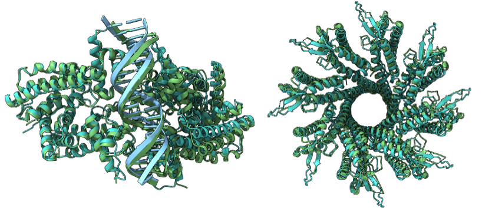

<h1 align="center">Boltz-1:

Democratizing Biomolecular Interaction Modeling
</h1>



Boltz-1 is an open-source model which predicts the 3D structure of proteins, rna, dna and small molecules; it handles modified residues, covalent ligands and glycans, as well as condition the generation on pocket residues. 

For more information about the model, see our [technical report](https://gcorso.github.io/assets/boltz1.pdf).

## Installation
Install boltz with PyPI (recommended):

```
pip install boltz
```

or directly from GitHub for daily updates:

```
git clone https://github.com/jwohlwend/boltz.git
cd boltz; pip install -e .
```
> Note: we recommend installing boltz in a fresh python environment

## Inference

You can run inference using Boltz-1 with:

```
boltz predict input_path
```

Boltz currently accepts three input formats:

1. Fasta file, for most use cases

2. A comprehensive YAML schema, for more complex use cases

3. A directory containing files of the above formats, for batched processing

To see all available options: `boltz predict --help` and for more informaton on these input formats, see our [prediction instructions](docs/prediction.md).

## Training

If you're interested in retraining the model, see our [training instructions](docs/training.md).

## Contributing

We welcome external contributions and are eager to engage with the community. Connect with us on our [Slack channel](https://boltz-community.slack.com/archives/C0818M6DWH2) to discuss advancements, share insights, and foster collaboration around Boltz-1.

## Coming very soon

- [ ] Pocket conditioning support
- [ ] More examples
- [ ] Full data processing pipeline
- [ ] Colab notebook for inference
- [ ] Confidence model checkpoint
- [ ] Support for custom paired MSA
- [ ] Kernel integration

## License

Our model and code are released under MIT License, and can be freely used for both academic and commercial purposes.
